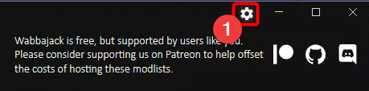
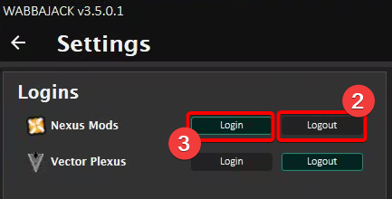
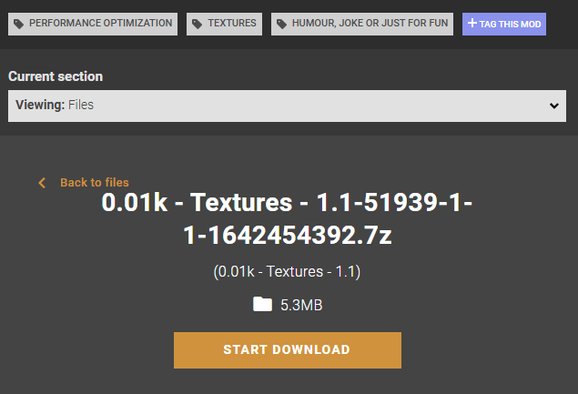

# Troubleshooting FAQ

This page is and will always be in development and update over time.

## Wabbajack Setup

### Wabbajack refusing to launch

- If you've used Wabbajack before, try the following:  
  > **Reset Your Wabbajack Installation**
  >
  >To completely reset your Wabbajack settings, start off by closing Wabbajack if it is open. Afterwards, press `Windows + R` on your keyboard and type in `%localappdata%`.
  >
  >You should see a Windows Explorer window pop-up; find and delete the folder called Wabbajack.

  **Important:** `%localappdata%` **NOT** `%appdata%` !!

  This will **NOT** affect any already installed lists or downloaded files.

- If have never used Wabbajack before or the previous instructions didn't work, try the following:  
  > **Manually Install Wabbajack**
  >
  > To manually install Wabbajack go to [the latest release](https://github.com/wabbajack-tools/wabbajack/releases/latest) and download both the `X.X.X.X.zip` (will be the latest version number instead of X.X.X.X) and the `Wabbajack.exe`.
  >
  > Go to a folder on one of your drives and create a folder called `Wabbajack`. If you are using an existing folder, make sure you empty it before proceeding. Now copy the previously downloaded files into this folder.
  >
  > Extract the `X.X.X.X.zip` in a way that you have a folder called `X.X.X.X` (again the current version number) filled with the contents of the .zip archive.
  >
  > Now you should be able to run Wabbajack from the `Wabbajack.exe`

### Wabbajack lists won't install to a folder on my Desktop or My Documents!

> These locations are called "protected folders" and Windows places extra restrictions on these locations by default. Thus they are not suitable places to run Wabbajack from or install modlists to.
>
> Some common protected folders and other folders that are known to causes issues are: Downloads, Desktop, Documents, Videos, Pictures, OneDrive, Program Files, or any other folder that is part of a standard Windows install. This restriction applies to any subfolders of these folders as well.
>
> Additionally, the root level of a drive is also protected. Your Wabbajack.exe file should not be located at C:\Wabbajack.exe. 
> 
> This protection will interfere with Wabbajack operation. Therefore, it is recommended you create a new folder near the root of your drive and place the Wabbajack.exe file within. For instance, create C:\Wabbajack and place Wabbajack.exe within this folder.
>
> These protections apply to modlist installation locations as well. It is recommended you create new folder near the root of your drive and then create new folder for your modlist within that folder. For instance, create C:\modlists, then create C:\modlists\my-new-modlist.

## Downloading Files

This covers the know download issues and solutions.

### X File Failed to download

> **Check the Log**
>
> Inside your Wabbajack folder should be another folder with the version number of the current version of Wabbajack.
>
> Navigate to this folder. Inside will be a `logs` folder.
>
> Navigate to this folder and find the most recent log (the one where installation failed)
>
> At the very end will be a list of web links for files that failed to download. You can download these manually and relocate them to your modlist's downloads folder.
>
> **It is important to delete incomplete versions of the failed files from this folder before the attempt.**

### All Nexus Files Failed to Download

> **Logout / Login to Nexus**
>
> Click the Gear icon in the upper right of the Wabbajack app.
>
> 
>
> Toggle the `Login` button to `Logout,` and back to `Login.`
>
> 
>
> Follow the normal process for logging into Nexus.

### Many Nexus and/or Other Files Failed to Download

> Visit the Nexus webpage and change the location of your CDN (Content Delivery Network)
>
> These are a system of servers spread throughout the world to host mods.
>
> The option is under Site Preferences in the menu to the top right. Set it to the location closest to your physical location.
>
> For files external to _Nexus_ a free VPN may be necessary, such as _Proton VPN_ or _Cloudflare WARP._
>
> These will be slow and inefficient but may prompt proper downloads.
>
> (Neither Wabbajack nor its developers or support staff are associated with, promote, or endorse any individual VPN solution.)

### Some Nexus files Failed to download but are unavailable to manually download

> If you have an error as per following; 
>
> `00:00:27.152 [FATAL] (Wabbajack.Installer.StandardInstaller) Unable to download 0.01k - Textures - 1.1-51939-1-1-1642454392.7z (NexusDownloader+State|SkyrimSpecialEdition|51939|257556)`
>
> The file is not available anymore due to either being archived, under moderation, or deleted.  
> To check, you need to retrieve the following data,  
> `(NexusDownloader+State|game|mod_id|file_id)`
> and construct the download url from that, like so;
> `https://www.nexusmods.com/<game>/mods/<mod_id>?tab=files&file_id=<file_id>`
> 
> For example, if you have a log entry like above,  
> The game name is `SkyrimSpecialEdition`,  
> the mod_id is `51939`,  
> and the file_id is `257556`.  
> then you'll get the following link, which you can use for a direct manual download;
> `https://www.nexusmods.com/skyrimspecialedition/mods/51939?tab=files&file_id=257556`
>
> 
>
> If however you get an error "file is not found" or "page not found", then this means the file or mod got removed from NexusMods and is unavailable.  
> This also means the modlist is unavailable to install, until the modlist author recompiles the modlist without the unavailable mod.

## Using Wabbajack

### Can I use Wabbajack with Gamepass / Microsoft Store / Xbox Games?
> Short answer - NO.
> 
> Long answer - Script extenders (such as SKSE) are currently not compatible with Gamepass versions of Bethesda games. Without these, it is not possible to run complex mods commonly found in Wabbajack modlists.
> 
> For example, SKSE will support the latest version of Skyrim available on Steam, and only this version . It is extremely unlikely that any future non-SE Skyrim updates will be released. SKSE cannot support any potential Windows Store release of Skyrim.

> Windows Store applications are locked down similarly to consoles and do not allow the APIs necessary for script extenders to work. - https://skse.silverlock.org/

### Wabbajack shows a black screen when trying to X

> **Install/Repair WebView2**
>
> Use the official WebView2 Installer found [here](https://developer.microsoft.com/en-us/microsoft-edge/webview2/#download-section).
>
> 
>
> If the above fails please install/repair WebView2 by following the answer to a similar issue linked here:
> <https://superuser.com/questions/1751709/how-to-reinstall-microsoft-edge-webview2-runtime>
>
> **Repair your windows installation**
>
> Wabbajack is built using various libraries made by Microsoft and some of them require core functions of Microsoft Windows to be present that might get removed when people use debloaters or custom Windows 10/11 ISOs to install Windows. So please repair your Windows if you ever have run such a debloater software/script.

### Wabbajack Modlists not loading or downloading

> **Conflicting Network Settings/Apps**
>
> `Killer Control Centre`/`Killer Intelligence Center`/`Killer Network Service` are at least 4 known apps that contain settings that break Wabbajack. This software is known to be likely bundled with Dell/Alienware laptops but also be related to Intel chipsets because it shows up in the Intel Driver Support app. To fix the issues they cause with Wabbajack you need to:
>
> - disable the Prioritization Engine
> - possibly need to disable Auto Bandwidth too
>
> At least that's what fixed it for the user that figured out this conflict and other users that had similar issues.

> **Some people are unable to connect to Github**
>
> In India and maybe other countries, Github has been placed on block lists for some ISPs. If you can't even reach www.github.com or any of its subdomains, then your only option for using WJ is a VPN.

### Wabbajack Extraction Errors

> **Sanity Check Error**
>
> `[ERROR] (Wabbajack.InstallerVM) Sanity check error extracting`
>
> - If your system locale (language) is set to any language not using latin-script letters (like English does) set your system language to English or any other latin-script language you can understand and the issue is likely fixed. (It has worked for some people in the past.)
> - Other possible reasons for this and workarounds or fixes are unknown at the time of writing this.

### texconv Error

> This error means that you are missing one (or more) pre-requirements for wabbajack.
> 
> Please download and make sure you have installed `Microsoft Windows Desktop Runtime .NET 8` from the following url;  
> <https://dotnet.microsoft.com/en-us/download/dotnet/thank-you/runtime-desktop-8.0.4-windows-x64-installer>
> And `Microsoft Visual C++ 2019 Runtime` from the following url;
> <https://aka.ms/vs/16/release/vc_redist.x64.exe>
> 
> Then reboot your PC, and try installing the modlist again.

### BSOD (Blue Screen of Death) / PC Crash

> **SYSTEM_THREAD_EXCEPTION_NOT_HANDLED**
>
> - **Overclocking:** If you get this Blue Screen one of your drivers is acting up. As a gamer, this is most likely due to an unstable overclock. The reason you are likely "only" crashing when using Wabbajack is because Wabbajack was written to use all your system resources at their most potential, effectively stresstesting your hardware. Even GPU overclocks may cause this instability as Wabbajack uses your GPU for texture processing during installation.
> - **Driver Issues:** If you didn't overclock your system the same principle applies only that one of your drivers seems to be broken and should be repaired. More details on this can be found [here](https://helpdeskgeek.com/windows-10/how-to-fix-a-system-thread-exception-not-handled-bsod/).

### Don't run as Admin!

> **"But I am not running it as Admin"**
>
> You might not have explicitly chosen to run Wabbajack with admin privileges, but this error indicates Wabbajack is running as such. If you have disabled [UAC](https://en.wikipedia.org/wiki/User_Account_Control), Windows will run every program as an administrator. 
> If it is only disabled, you can simply enable UAC like this:
> 
> After doing this, restart your PC for the change to take effect.
>
> If you have a customised installation of Windows and cannot access UAC try the following:
>
> > 1. Create a basic user account (Accounts -> Other users then add other user, click on Users, more actions and create new user)
> > 2. Login to that account - start Skyrim to add the registry entries for that user
> > 3. Log back into your primary account
> > 4. Hold shift, right click the .exe which will give a "Run as different user" command
> > 5. Select your created basic user
> >
> > Wabbajack is not responsible for any issues arising from attempting to run the application on non-standard Windows installations.

### Wabbajack says one or more downloaded mods have a hash of "menYUTfbRu8=", which does not match the expected hash. 

> This error usually appears when you do not have enough free disk space on your computer's drive. Be sure you have enough free space for your modlist before installing. Additionally, you should have an extra 40-60GB available or you may encounter other issues.

## Miscellaneous

### Some modlists require a higher pagefile?

> Some modlists require a higher than default RAM setting. Windows can increase your RAM by allocating an amount of disk space but generally only up to 8 GB.
>
> **Never disable the pagefile - this may lead to various issues on your system, such as BSOD crashes.
>
> You can increase this virtual allocation by going into your Page File settings. 
> > 1. Press WinKey + R to open your Run panel.
> > 2. Type or copy paste the following command `sysdm.cpl ,3`.
> > 3. Under the Performance section, press 'Settings'.
> > 4. Go to the Advanced tab at the top, and at the Virtual memory section press 'Change...'.
> > 5. Disable 'Automatically manage paging file size for all drives'
> > 6. If you have more than one drive, try enabling it for at least one more drive as a backup (make sure it has a decent bit of free space, like 15GB).
> > 7. Set the size to 'System managed size'. Otherwise, set a custom size for the drive it's currently on and increase the maximum size to be at least 20GB.
>
> It's recommended to only enable it on SSDs, as enabling Page File on HDDs might cause stutters.
