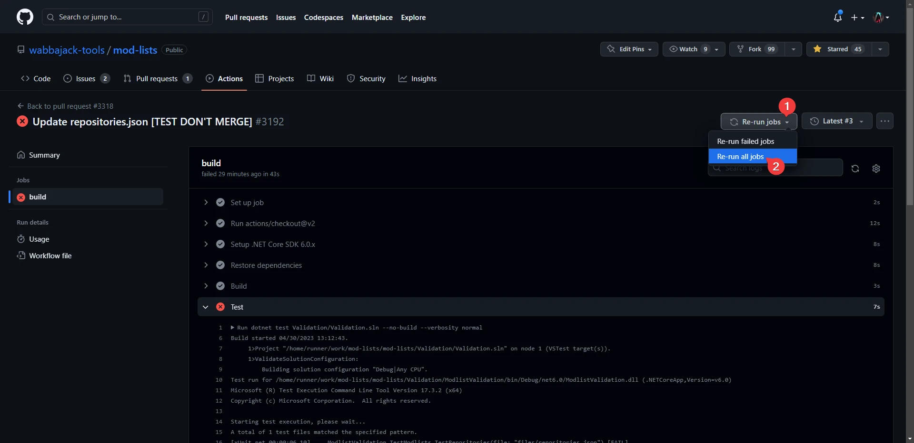
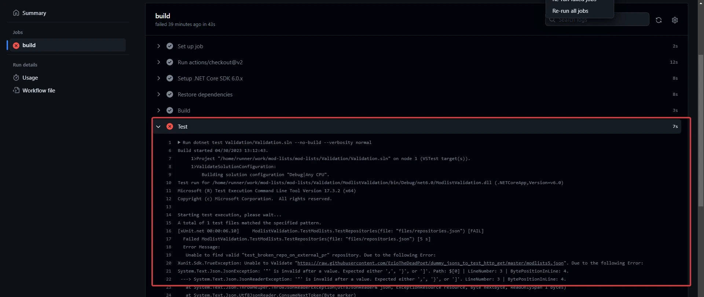

# Repository Validation

**This section is important for everyone with merge permissions!**

## General Information

We all know how frequently in the past a broken .json file has caused us headaches like a broken gallery in the app and on the website. To fix this the github Validation for modlist repositories has been updated. It now also validates the repositories.json AND the in there linked .json files.

The test will run every 4 hours, pull request and commit made to the mod-lists repository.

To check past runs or trigger a new run on the main repository (in case the website and app gallery are broken and you need to find the issue) go to the [Github Actions Tab](https://github.com/wabbajack-tools/mod-lists/actions/workflows/validation.yml)

## Merging Procedure

Before merging older pull requests it is recommended to run the validation again **even if they are validated**, because the linked json file could have been broken or deleted over time or a previously broken json got fixed already.  

1. Go to the Details page of the Validation run:  
  
2. Re-run all jobs:  
  
3. When the run is successful the pull request can be merged or when it was just a normal run then the gallery is in perfect condition.  
If the run is unsuccessful you can find the reason for the test failing in the log under the test section:  
  
In this example the error was a missing `,` in the .json file of the repository planned to be merged.
